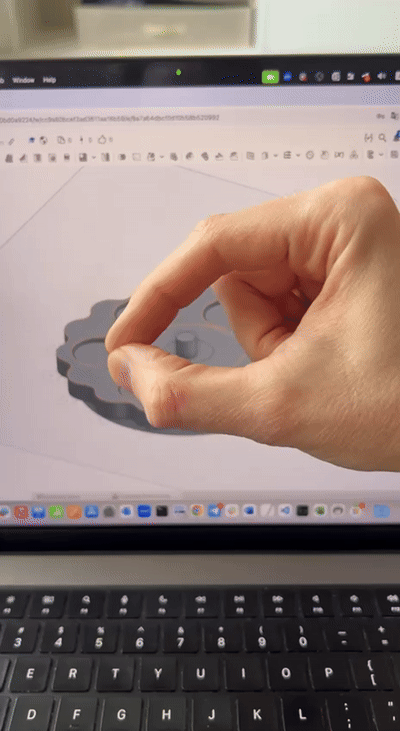

# ml-mouse-spacer

### Installation

Install all dependencies: opencv, mediapipe, tensorflow, pyautogui and etc.

### How does it work?

There is a model to recognize gestures.

Now it works with two types:

Then, this application emulates mouse and keyboard and uses this for navigation.

You can change this behavior and you can change other parameters to move mouse